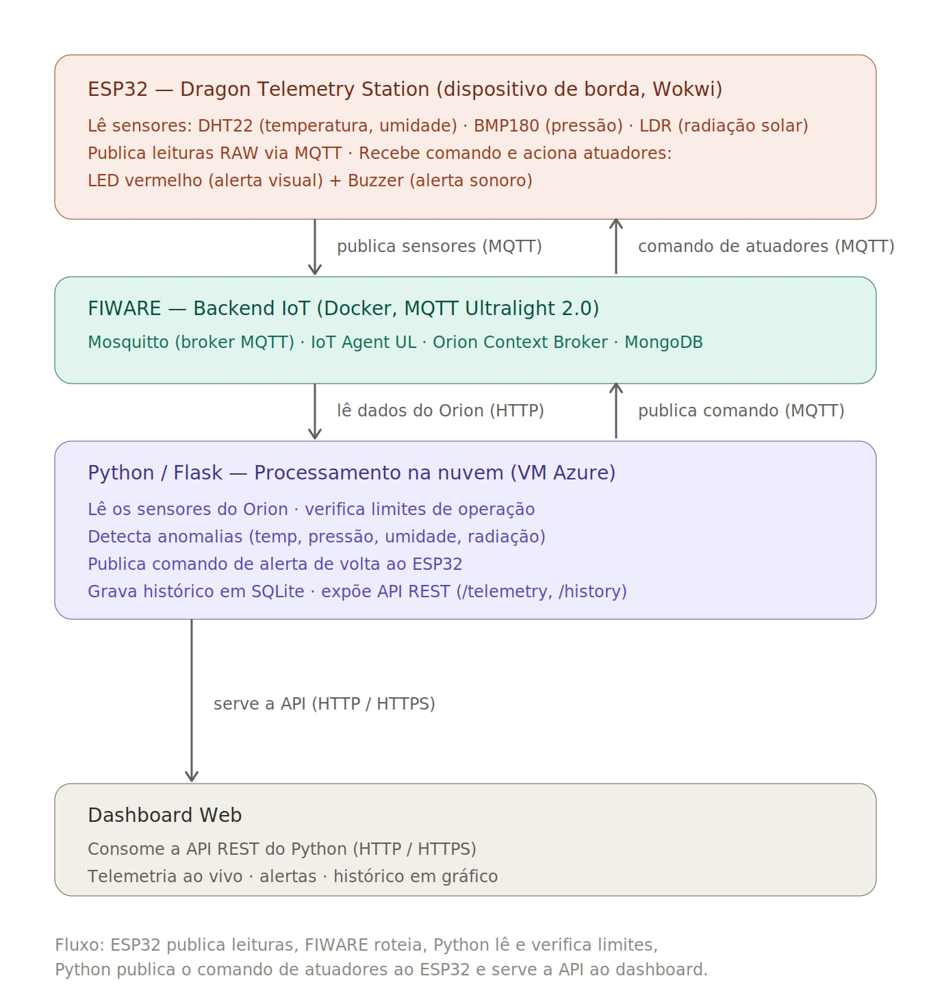

# Dragon Telemetry Station
### Edge Computing & Computer Systems · Global Solution 2026 · FIAP

> Sistema de telemetria para a cápsula Dragon da SpaceX. O ESP32 simula os sensores da cápsula e transmite dados via MQTT para o FIWARE na nuvem. O Python processa os parâmetros, detecta anomalias e envia comandos de alerta ao ESP32. O dashboard React consome a API REST em tempo real.

---

## Equipe

| Nome | RM |
|---|---|
| Gustavo Macedo Daniel | 567594 |

---

## Links

| Recurso | Link |
|---|---|
| Repositório GitHub | [edge-dragon](https://github.com/gustavoczmacedo-cyber/edge-dragon) |
| Simulação Wokwi | [Abrir no Wokwi](https://wokwi.com/projects/466392137940259841) |

---

## O Problema

Durante uma missão da cápsula Dragon, os parâmetros de operação precisam ser monitorados continuamente e transmitidos à Terra em tempo real. Anomalias em temperatura, pressão ou umidade podem indicar falha crítica e exigem resposta imediata da equipe de controle e alerta aos tripulantes.

---

## Arquitetura do Sistema



```
ESP32 (Wokwi)
├── DHT22  → temperatura, umidade
├── BMP180 → pressão atmosférica
├── LDR    → radiação solar (luminosidade)
└── Publica dados via MQTT (Ultralight 2.0)
        │
        ▼
FIWARE — Backend IoT (Docker, VM Azure)
Mosquitto (MQTT) · IoT Agent UL · Orion Context Broker · MongoDB
        │
        ▼
Python / Flask — Processamento na nuvem
├── Lê parâmetros do Orion
├── Verifica limites de operação
├── Publica comando de alerta ao ESP32 via MQTT
├── Grava histórico em SQLite
└── Expõe API REST (/telemetry, /history)
        │
        ▼
Dashboard React (GitHub Pages)
Consome a API REST · telemetria ao vivo · histórico em gráfico · alertas
```

---

## Parâmetros de Telemetria

| Parâmetro | Sensor | Limite de Alerta |
|---|---|---|
| Temperatura | DHT22 | < 10°C ou > 40°C |
| Umidade | DHT22 | > 80% |
| Pressão | BMP180 | < 950 hPa |
| Radiação (LDR) | LDR | > 3500 (raw) |

Quando qualquer parâmetro sai dos limites: Python envia comando `alert` → ESP32 acende LED vermelho + dispara buzzer.

---

## Hardware — Componentes

| Componente | Função | Pino ESP32 |
|---|---|---|
| DHT22 | Temperatura e umidade | GPIO 15 |
| BMP180 | Pressão atmosférica | GPIO 21/22 (I²C) |
| LDR | Radiação solar | GPIO 34 |
| LED Vermelho | Alerta visual | GPIO 19 |
| Buzzer | Alerta sonoro | GPIO 27 |

---

## FIWARE — Integração IoT

**Tópicos MQTT:**

| Tópico | Direção | Descrição |
|---|---|---|
| `/dragon2026/dragon-esp32-001/attrs` | ESP32 → FIWARE | Publica leituras dos sensores |
| `/dragon2026/dragon-esp32-001/cmd` | Python → ESP32 | Envia comando alert/normal |

**Formato Ultralight 2.0:**
```
t|24.5|h|55.0|p|1010.2|l|1800
```

---

## API REST

**Base URL:** `http://40.112.132.202:5000` · CORS liberado · sem autenticação

| Endpoint | Método | Descrição |
|---|---|---|
| `/health` | GET | Status da API |
| `/telemetry` | GET | Dados ao vivo com status e alertas |
| `/history?limit=N` | GET | Histórico SQLite para gráficos |

**Exemplo `/telemetry`:**
```json
{
  "temperatura": 24.5,
  "umidade": 55.0,
  "pressao": 1010.0,
  "ldr": 1800,
  "status": "normal",
  "alertas": [],
  "lastUpdate": "14:32:01"
}
```

---

## Como Executar

### 1. Subir o FIWARE na VM
```bash
cd ~/dragon-fiware
docker-compose up -d
docker ps
```

### 2. Iniciar a API Python
```bash
sudo systemctl start dragon-python
sudo systemctl status dragon-python
```

### 3. Provisionar o dispositivo (Postman)
Importe `postman/dragon-fiware.postman_collection.json` e execute na ordem:
```
2.1 Criar Service Group → 2.2 Registrar Dispositivo → 3. Verificar Entidade
```
> Headers obrigatórios: `fiware-service: dragon` · `fiware-servicepath: /`
>
> **Importante:** após cada reinício da VM, reprovisione o dispositivo (passos 2.1 e 2.2).

### 4. Iniciar o Wokwi
Abrir o [projeto no Wokwi](https://wokwi.com/projects/466392137940259841) e clicar em Play. O ESP32 conecta na rede `Wokwi-GUEST` e começa a publicar via MQTT.

### 5. Verificar funcionamento
```bash
curl http://40.112.132.202:5000/health
curl http://40.112.132.202:5000/telemetry
```

---

## Configuração de Segredos

O IP público da VM Azure é `40.112.132.202`. Caso seja necessário atualizar, substitua em:
- `hardware/dragon_wokwi.ino` — constante `MQTT_BROKER`
- `postman/dragon-fiware.postman_collection.json` — variáveis HOST, ORION, IOTA

---

## Estrutura do Repositório

```
dragon-telemetry/
├── README.md
├── docker-compose.yml              ← FIWARE (Orion + IoT Agent + Mosquitto + MongoDB)
├── mosquitto.conf
├── .gitignore
├── hardware/
│   └── dragon_wokwi.ino            ← código do ESP32 (Wokwi)
├── python/
│   ├── dragon_python.py            ← Flask + FIWARE + alertas + histórico
│   ├── requirements.txt
│   └── dragon-python.service       ← serviço systemd
├── postman/
│   └── dragon-fiware.postman_collection.json
└── docs/
    └── arquitetura.png             ← diagrama da arquitetura
```

---

## Stack Técnica

| Camada | Tecnologia |
|---|---|
| Dispositivo de borda | ESP32 (Wokwi) + DHT22 + BMP180 + LDR + LED + Buzzer |
| Protocolo | MQTT — Ultralight 2.0 |
| Backend IoT | FIWARE (Orion + IoT Agent UL + Mosquitto + MongoDB) |
| Processamento | Python 3 + Flask |
| Histórico | SQLite |
| Infraestrutura | VM Azure Ubuntu 22.04 + Docker Compose |
| Dashboard | React (GitHub Pages) |

---

*FIAP · Engenharia de Software · 1ESPA · Global Solution 2026*
